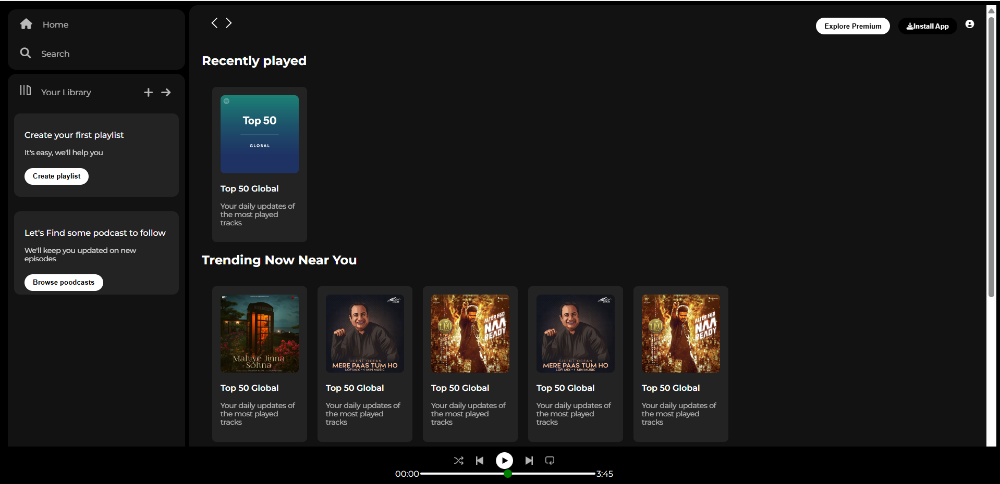
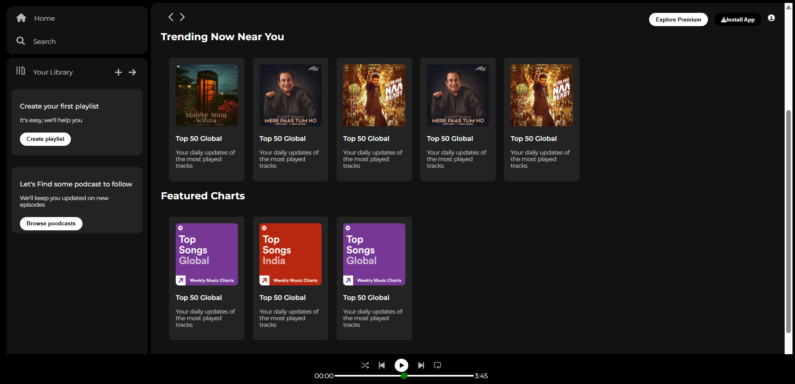

<h1 align="center">🎵 Spotify Clone</h1>

<p align="center">
  
  
  
  
</p>

---

## 🖥️ Project Overview

This is a visually appealing **Spotify Clone Web App** inspired by the original Spotify UI. It mimics key layout and interface elements such as:

- Sidebar navigation with Home, Search, and Library
- Responsive main music cards with thumbnails
- Sticky navbar for forward/backward buttons and user icon
- Bottom music player layout with play controls and progress bar
- Hover effects and modern transitions

---

## 🚀 Features

- 🎨 Fully styled with **HTML + CSS**
- 📱 Clean and responsive design
- 🧭 Sidebar and sticky navigation
- 📂 Music cards for trending and featured songs
- 🎛️ Music player layout (non-functional, UI only)
- 🖼️ Custom assets and icons for Spotify-like feel

---

## 🛠️ Tools & Technologies Used

<p align="center">
  
  
  
  
</p>

---

## 📸 Screenshots

<div align="center">
  
  
</div>

---

## 📌 Note
🧪 This project was created as part of my practice in frontend web development. It focuses on replicating the UI/UX design of Spotify using HTML, CSS, and JS, without backend functionalities or APIs.

---

## 🙌 Feel free to explore the code, give feedback, or connect!

## 📂 Folder Structure

```bash
/
├── index.html        # Main HTML page
├── style.css         # Custom CSS styling
└── assets/           # All icons, images, and logos
